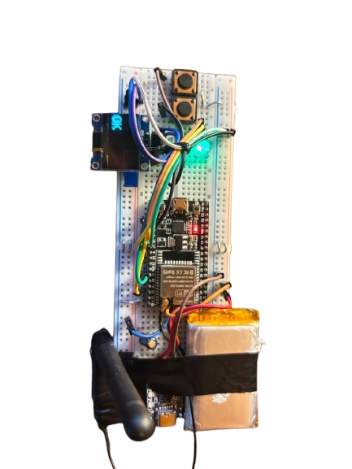
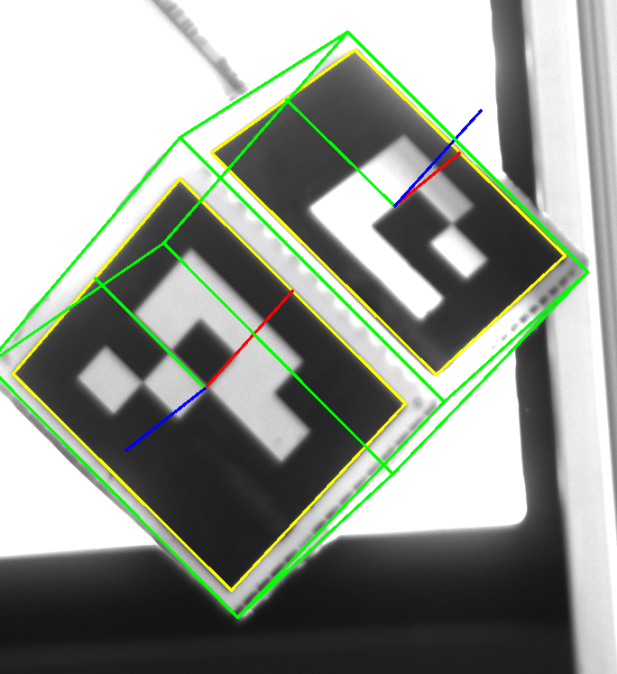

# ArUco Pen Pose Tool

A compact hardware and software stack for estimating the pose of a 3D‑printed pen tip.  
An ESP32 inside the pen sends a BLE trigger; the PC listens for the event, grabs a frame from a camera and computes the pen pose from ArUco markers.

## Idea



## Hardware
- ESP32 with BLE and two push buttons
- 3D‑printed pen body and cube with 3–4 ArUco markers
- Basler industrial camera or any UVC webcam
- ChArUco or chessboard target for camera calibration

## Software
- **ESP32 firmware** – BLE trigger and UI (see [`esp32/README.md`](esp32/README.md))
- **PC capture pipeline** – Python + OpenCV/Bleak with optional Basler support (see [`pc/README.md`](pc/README.md))
- **`cube_minimal` library** – cube pose utilities (see [`cube_minimal/README.md`](cube_minimal/README.md))

## Workflow
1. Press a button on the pen. The ESP32 publishes a BLE notification.
2. The PC application receives the trigger and acquires an image from the selected camera.
3. ArUco markers on the cube are detected and the cube pose is estimated.
4. A fixed transform gives the pen‑tip pose, which can be logged or streamed.

## Quick start
### PC setup
```bash
cd pc
python -m venv .venv
source .venv/bin/activate        # Windows: .venv\Scripts\activate
pip install -r app/requirements.txt
```
Edit [`pc/app/config.yaml`](pc/app/config.yaml) to choose the camera (`camera_id` or Basler serial), output folder and pose options.

### Calibration
Use the scripts in [`pc/calib/`](pc/calib/) with a printed ChArUco or chessboard target to produce `calib_data.npz` for the camera intrinsics.

### Capture & pose
```bash
python app.py --ble-name ARU-PEN --camera 0 --dict DICT_4X4_50 --marker-size-mm 20.0
```
Captured frames appear under `pc/captures/` and are processed by the pose worker.

## Further reading
- [`pc/README.md`](pc/README.md) – detailed PC configuration, Basler parameters and pose pipeline
- [`esp32/README.md`](esp32/README.md) – hardware, LED and button logic
- [`cube_minimal/README.md`](cube_minimal/README.md) – cube pose estimation module

## License
All rights reserved.

This software and all associated files are the exclusive property of <Angelo Milella - COMAU>.
Unauthorized copying, modification, distribution, or use of this software, via any medium, is strictly prohibited.

For inquiries about licensing, please contact: <angelo_milella_dev@yahoo.com>.
